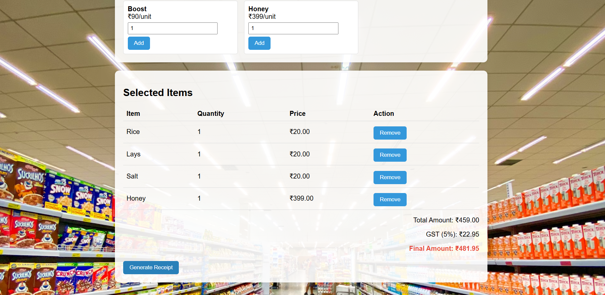

🛒 Supermarket Bill Generator

A simple **Supermarket Bill Generator** built using **HTML, CSS, and JavaScript**.  
It allows customers to select items, specify quantities, automatically calculate the total with GST, and generate a detailed receipt.

📌 Features
- ✅ Add items to the shopping cart with quantity  
- ✅ Auto calculation of total amount  
- ✅ GST (5%) included in billing  
- ✅ Generate a clean receipt with customer name and date  
- ✅ Responsive and user-friendly UI  

📂 Project Structure

├── templates/

       ├── supermarket.html   # Main bill generator page

       ├── super.html         # Alternate styled version with background

├── super.jpeg             # Demo image / background

├── screenshots/
   ├── screenshot.png     # Main billing page screenshot (placeholder)

   ├── screenshot2.png    # Receipt page screenshot (placeholder)

🚀 How to Run
1. Clone the repository:
   ```bash
   git clone https://github.com/your-username/Super-Market-Bill-Generator.git
```
2. Open `supermarket.html` or `super.html` in a browser.
3. Enter your name, select items, and click **Generate Receipt**.

🖼️ Screenshots
📌 *Upload your screenshots into the `screenshots/` folder with the names below to make them visible.*

### Main Billing Page


### Generated Receipt Example



🛠️ Technologies Used
* **HTML5** – Structure
* **CSS3** – Styling
* **JavaScript** – Logic and receipt generation

🎯 Future Enhancements
* 🔹 Add more products & categories
* 🔹 Option to download receipt as PDF
* 🔹 Backend integration for real product management

